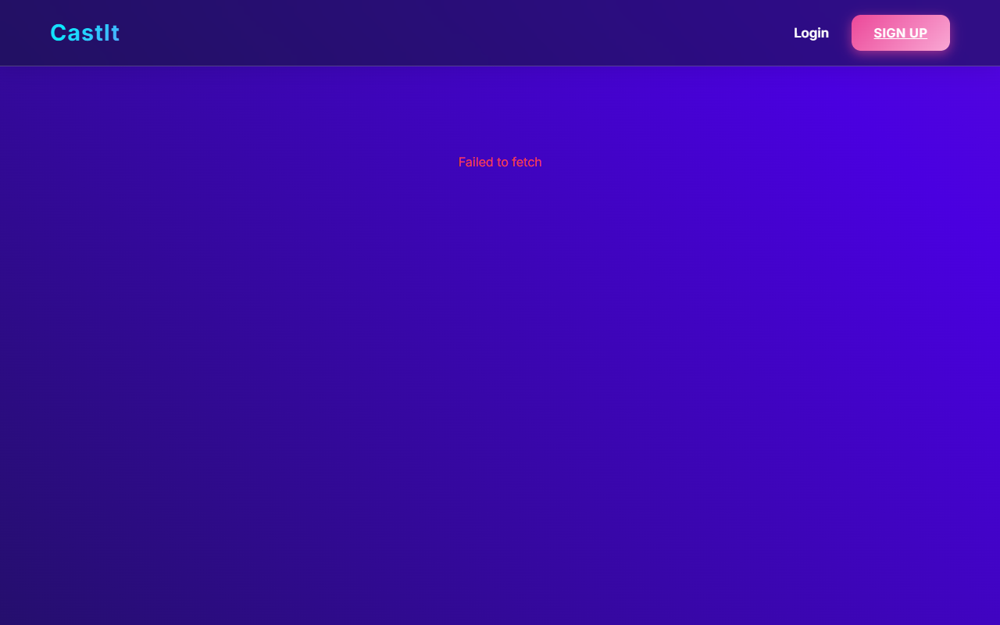
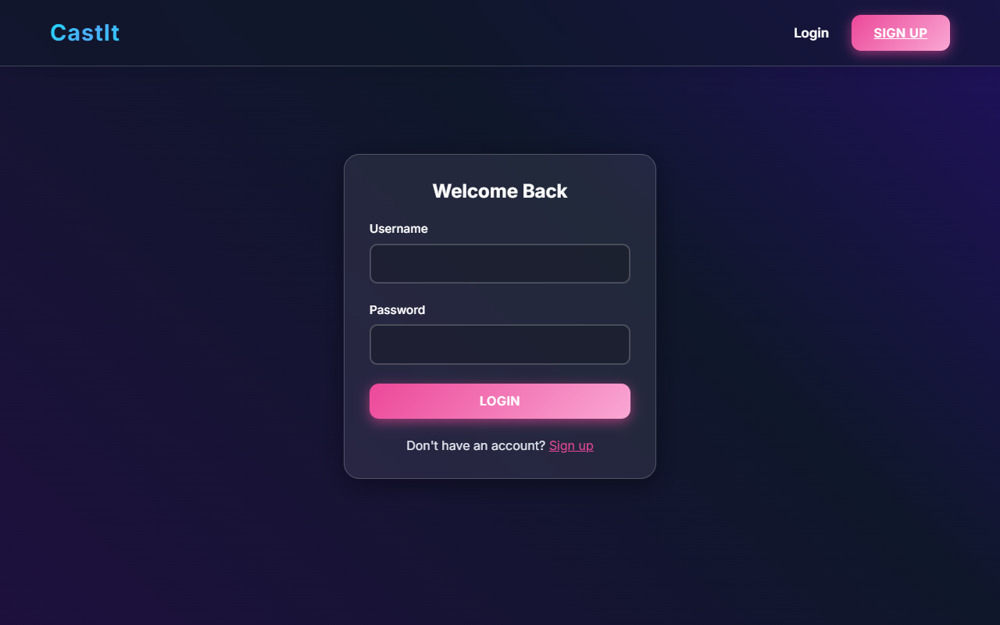
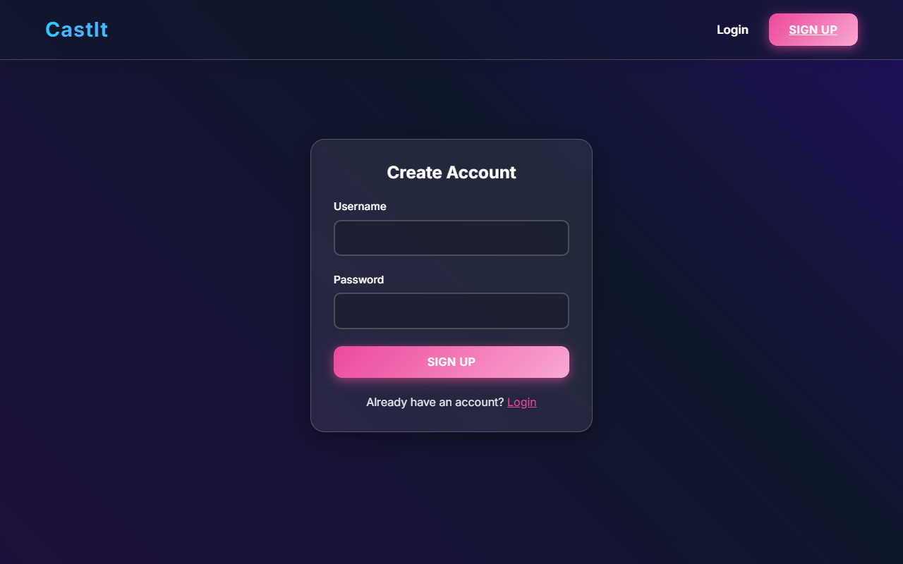

# CastIt - Smart Voting System

CastIt is a modern, enterprise-ready full-stack electronic voting and polling application. The intuitive interface and real-time backend make it seamless for users to create polls, cast their votes, and view dynamic results.

## Overview

Designed with an aesthetic, premium UI, CastIt provides a robust and secure way to gather opinions. By integrating a dynamic React frontend with a secure Spring Boot backend, the app delivers a smooth, highly responsive user experience. 

### Screenshots

#### Dashboard


#### Login Page


#### Registration Page


## Features

- **User Authentication:** Secure JWT-based authentication system for registration and login.
- **Poll Creation:** Authenticated users can dynamically create polls with custom questions and multiple options.
- **Vote Restrictions:** The system strictly ensures users can only vote once per poll.
- **Time-sensitive Polls:** Support for poll deadlines and expiry tracking.
- **Interactive UI:** A highly polished layout built using React, Vite, and custom CSS adhering to modern UI/UX principles.

## Technology Stack

- **Frontend:** React, Vite, React Router, CSS
- **Backend:** Java Spring Boot, Spring Security (JWT), Hibernate/JPA
- **Database:** MySQL

## Getting Started

### Prerequisites

- Node.js & npm
- Java 17+ and Maven
- MySQL Server

### Setup Instructions

1. **Clone the repository:**
   ```bash
   git clone https://github.com/Bhawika-343/CastIt.git
   cd CastIt
   ```

2. **Database Configuration:**
   Ensure your MySQL server is running. Create a database `smart_voting` (the application creates it automatically if configured to do so). Default credentials are `root` for username and `Bhawika@123` for password on port `3306`. Update `backend/src/main/resources/application.properties` if needed.

3. **Running the Backend Server:**
   Navigate into the `backend` folder and start the Spring Boot Application:
   ```bash
   cd backend
   .\mvnw.cmd spring-boot:run
   ```
   The backend will start locally on `http://localhost:8085`.

4. **Running the Frontend Application:**
   Open a new terminal, navigate to the `frontend` folder, install dependencies, and run:
   ```bash
   cd frontend
   npm install
   npm run dev
   ```
   The frontend will be accessible at `http://localhost:5173`.
